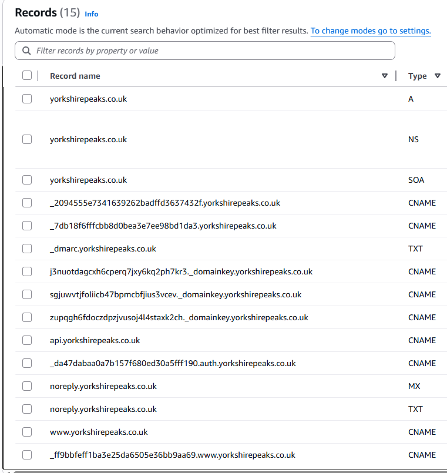

# Yorkshire 3 Peaks Website

This Mono-Repo will hold all the code related to the website

Additionally READMEs are in the sub directories on what they do and how to develop in them

## Frontend Technology

- language: javascript
- frontend framework: next
- package manager: npm
- node version: Node.js 20
- MaterialUI Web Components

## Backend Technology

Currently using AWS SAM to deploy our backend as IaC

### API

- AWS Lambda
- AWS api gateway

### Database

- AWS DynamoDB

## Hosting service

AWS technology stack

- Amplify
- Cognito
- API Gateway
- Lambda
- DynamoDB

## Deployment

Deployments are setup to auto deploy on merge into main

- Amplify is setup to trigger a build and deploy of the ui
- A github action job is setup to deploy the backend via AWS SAM CLI

### Github Action Runner

In order to make a runner you need follow the instruction for registering a runner for a project from github. We also need a few other prerequisite packages in order for the github job to work (assuming you are working in Ubuntu 24.04 or above):

- unzip
- libgtk2.0-0t64
- libgtk-3-0t64
- libgbm-dev
- libnotify-dev
- libnss3
- libxss1
- libasound2t64
- libxtst6
- xauth
- xvfb
- (might be others that i don't know about yet)

# Development

you will need a few thing in order to get this project running inside the devcontainer

- Docker
- AWS CLI

ask an existing developer for the .env file values

# ReStart up guide

This guide assume you are building off the already exist account that used to run this project

## New domain from AWS Route 53

Create a domain name as well as a hosted zone if the hosted zone is not automatically created from the domain creation

You will need to add the following records manually:
| Record name | Type | Routing policy | Differentiator | Alias | Value/Route traffic to | TTL |
| ----------------------------------------------------------------- | ----- | -------------- | -------------- | ----- | --------------------------------------------------- | --- |
| noreply.domainname | MX | Simple | - | No | 10 feedback-smtp.eu-west-2.amazonses.com | 300 |
| noreply.domainname | TXT | Simple | - | No | "v=spf1 include:amazonses.com ~all" | 300 |
| key.\_domainkey.domainname | CNAME | Simple | - | No | key.dkim.amazonses.com | 300 |
| key.\_domainkey.domainname | CNAME | Simple | - | No | key.dkim.amazonses.com | 300 |
| key.\_domainkey.domainname | CNAME | Simple | - | No | key.dkim.amazonses.com | 300 |
| \_dmarc.domainname | TXT | Simple | - | No | "v=DMARC1; p=none;" | 300 |

I am pretty sure these are the ones you have to add manually

this is a picture of wht it looked like before:


## New cert for new domain from AWS Certificate Manager

| Domains       |
| ------------- |
| domainname    |
| \*.domainname |

You might need to add the cert records to the hosted zone manually or it might add them automatically

## Create new app From AWS Amplify connecting it to the git repo

Set app to use:
| Key | Value |
| ---------- | ------------- |
| Platform | WEB_COMPUTE |
| Framework | Next.js - SSR |
| Production | Branch main |

Build setting:

```
version: 1
applications:

- appRoot: ui
  frontend:
  phases:
  preBuild:
  commands: ['npm install']
  build:
  commands: ['npm run build']
  artifacts:
  baseDirectory: build
  files: - '\*_/_'
  cache:
  paths: []
```

You will need to specify to build using node 22.14.0 as that is what we are using to run the app currently - if AWS no longer supports this you will need to update the app before launching it to aws to a compatible version

Register the custom domain and cert with the app

| URL                    | Branch | Redirects to       |
| ---------------------- | ------ | ------------------ |
| https://domainname     | main   | -                  |
| https://www.domainname | main   | https://domainname |

Set environment variables:
| Key | Value |
| ---------------------------------- | ----------------------------------------------------------------------------------------------------------- |
| AMPLIFY_DIFF_DEPLOY | true |
| AMPLIFY_MONOREPO_APP_ROOT | /ui |
| AUTH_COGNITO_ID | 132t6iujci1bb13ilitrcko1l6 |
| AUTH_COGNITO_ISSUER | https://cognito-idp.eu-west-2.amazonaws.com/eu-west-2_Jitl5Br5F |
| AUTH_COGNITO_SECRET | cognito_secret get this from the Admin email under secrets pool |
| NEXT_PUBLIC_API_URL | https://api.domainname/ |
| NEXT_PUBLIC_AWS_REGION | eu-west-2 |
| NEXT_PUBLIC_STRIPE_PUBLISHABLE_KEY | pk_live_51SWIiiCVb98uBn6b2QRthhRBPKl6HwjXrpHROl0mscCU3XQEROdxgIoK0TgwUrv1EczVCxIK0QlkqkhU0ZdfQlQh00Fjo5Z6Zk |
| NEXT_PUBLIC_USER_POOL_CLIENT_ID | 7g2g2m778tcjm5gcootc2jm0je |
| NEXT_PUBLIC_USER_POOL_ID | eu-west-2_U7iPe6Omz |
| \_LIVE_UPDATES | [{"name":"Node.js version","pkg":"node","type":"nvm","version":"22.14.0"}] |

Redirects:
| Source address | Target address | Type |
| -------------- | -------------------------------- | ---- |
| https://www.domainname | https://domainname | 301 (Redirect - Permanent) |
| /<\*> | /index.html | 404 (Rewrite) |

### Everything else is already setup from the previous deployment and was never taken down - however if you needed to you would just deploy the AWS SAM template and it should work if you replace a few hardcoded values
